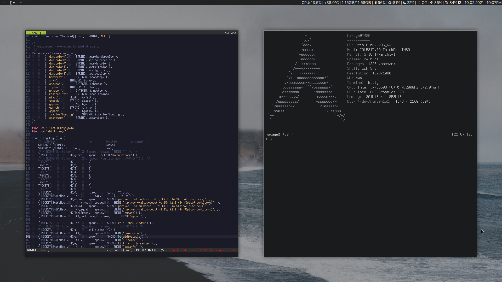

Dotfiles that i use for both my laptop and desktop.

These dots are used with Arch Linux with dwm as its window manager.

# Programs used #
* Distro : Arch Linux
* Window Manager : dwm
* Terminal : Kitty
* Browser : firefox
* Music Player : ncmpcpp
* File Manager : ranger
* Notifications : dunst
* Video Player : mpv

# Features #

* dwm built off of LukeSmith's build, with added patches such as: fancybar, attachbottom, more layouts and cfacts
* dwmblocks with various modules such as: wifi, bluetooth, dual battery status, memory usage, temperature, etc.
* riced ncmpcpp with cover art
* riced dunst with mpd notifications
* mpv with shaders and upscalers
* scripts for powermenu and select layout
* firefox with custom css

# Before Installing #

Various of these dots contain my username so they won't work for you outside of the box

# For a quick Install please install the following packages:

> paru -S firefox neovim ranger dragon-drag-and-drop zsh terminus-font adobe-source-han-sans-jp-fonts ttf-joypixels otf-san-francisco-pro kitty blueman ncmpcpp dunst i3lock-color-git xss-lock ibus ibus-mozc libxft-bgra lxappearance lxrandr maim mpc mpd mpv neofetch throttled nitrogen pcmanfm qbittorrent rofi thunderbird tlp tlpui ueberzug zathura youtube-dl lightdm picom terminus-font-ttf xdg-utils-mimeo feh sxiv code bpytop htop pavucontrol xbacklight

# Enable the following services:

> systemctl --user enable mpd

> systemctl --user enable mpd-notification

> systemctl enable tlp

> systemctl enable throttled

> systemctl enable bluetooth

> systemctl enable sshd

> systemctl enable lightdm

